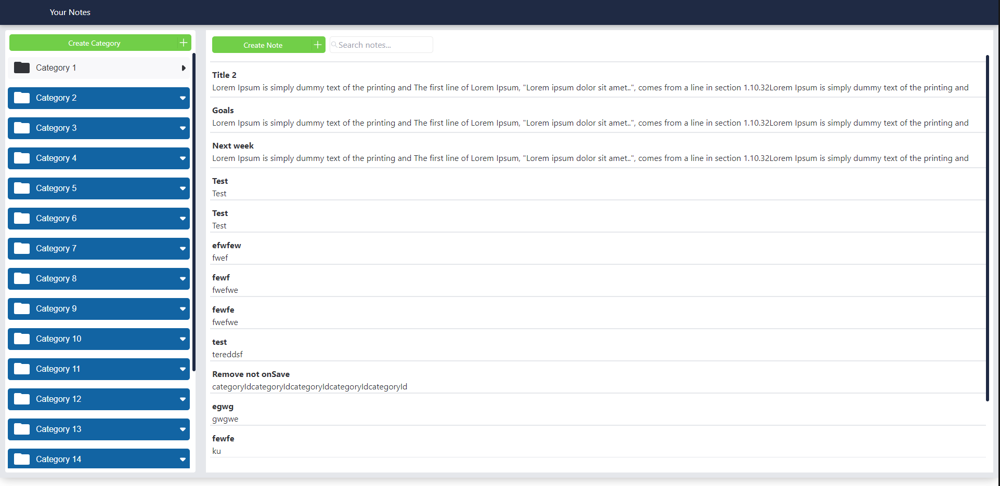
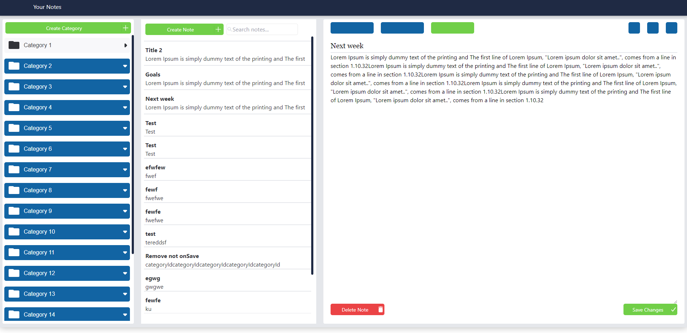

## Packages Installed

`@reduxjs/toolkit`
`react-redux`
`tailwind`

# Project Details

`1` This project is build using redux toolkit  
`2` store Folder have inside the slices folder with all the necessary reducers to store the data and to save them in local storage
`3` Components folder where all the actions take place. 
`4` Category Components was the first one build to manage the categories  and add notes based on the selected category
`5` Notes Components show all the notes based on the selected category id , create notes based on category and show 
note details for the selected note id /
`6` Note details component is able to modify a note content or to delete the note
`7` UI folder keeps all the reusable components such as type of buttons used in the web app
`8` Unit testing done to test the most important components and if there is any bug in the app
`9` Application is build using Tailwind Css and module.css for the Category PopOut Form

## This is a Todo Simple Implementation App build for Flex Business Solutions 

`Relating to the task please add answers to the following questions`

### 1- How might you make this app more secure?

This is a simple Todo App but to make the app more secure there  we can consider implementing the following measures:

`1 - Secure Backend` \
`2 - Authentication and Authorization` \
`3 - Error Handling messages` \
`4 - Serve the app over HTTPS to encrypt communication between client and server ` \

### 2- How would you make this solution scale to millions of records?

`1 - Using the right database to handle the records` \
`2 - A backend Server to handle the requests done by the clients` \
`3 - Virtual Scrolling to handle larg amount of records` \
`4 - Optimized Queries or Fetching Functions to retrive only the necessary data` \

#

#

# Getting Started with Create React App

This project was bootstrapped with [Create React App](https://github.com/facebook/create-react-app).

## Available Scripts

In the project directory, you can run:

### `npm start`

Runs the app in the development mode.\
Open [http://localhost:3000](http://localhost:3000) to view it in your browser.

The page will reload when you make changes.\
You may also see any lint errors in the console.

### `npm test`

Launches the test runner in the interactive watch mode.\
See the section about [running tests](https://facebook.github.io/create-react-app/docs/running-tests) for more information.

### `npm run build`

Builds the app for production to the `build` folder.\
It correctly bundles React in production mode and optimizes the build for the best performance.

The build is minified and the filenames include the hashes.\
Your app is ready to be deployed!

See the section about [deployment](https://facebook.github.io/create-react-app/docs/deployment) for more information.

### `npm run eject`

**Note: this is a one-way operation. Once you `eject`, you can't go back!**

If you aren't satisfied with the build tool and configuration choices, you can `eject` at any time. This command will remove the single build dependency from your project.

Instead, it will copy all the configuration files and the transitive dependencies (webpack, Babel, ESLint, etc) right into your project so you have full control over them. All of the commands except `eject` will still work, but they will point to the copied scripts so you can tweak them. At this point you're on your own.

You don't have to ever use `eject`. The curated feature set is suitable for small and middle deployments, and you shouldn't feel obligated to use this feature. However we understand that this tool wouldn't be useful if you couldn't customize it when you are ready for it.

## Learn More

You can learn more in the [Create React App documentation](https://facebook.github.io/create-react-app/docs/getting-started).

To learn React, check out the [React documentation](https://reactjs.org/).

### Code Splitting

This section has moved here: [https://facebook.github.io/create-react-app/docs/code-splitting](https://facebook.github.io/create-react-app/docs/code-splitting)

### Analyzing the Bundle Size

This section has moved here: [https://facebook.github.io/create-react-app/docs/analyzing-the-bundle-size](https://facebook.github.io/create-react-app/docs/analyzing-the-bundle-size)

### Making a Progressive Web App

This section has moved here: [https://facebook.github.io/create-react-app/docs/making-a-progressive-web-app](https://facebook.github.io/create-react-app/docs/making-a-progressive-web-app)

### Advanced Configuration

This section has moved here: [https://facebook.github.io/create-react-app/docs/advanced-configuration](https://facebook.github.io/create-react-app/docs/advanced-configuration)

### Deployment

This section has moved here: [https://facebook.github.io/create-react-app/docs/deployment](https://facebook.github.io/create-react-app/docs/deployment)

### `npm run build` fails to minify

This section has moved here: [https://facebook.github.io/create-react-app/docs/troubleshooting#npm-run-build-fails-to-minify](https://facebook.github.io/create-react-app/docs/troubleshooting#npm-run-build-fails-to-minify)
